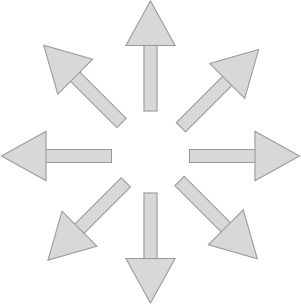
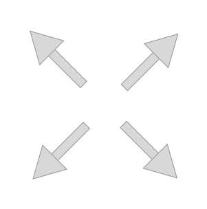
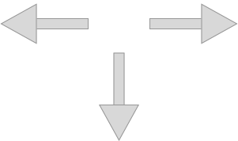

Phage is a two-player abstract strategy game with similarities to Chess,
though matches tend to be much shorter.

Each player takes turn moving one of their four pieces. Each piece can
be moved seven times. There are no pass moves. Draws are possible.

The pieces can move across any number of blank cells, but they move in different ways:

**Circle** moves horizontally, vertically, or diagonally in any direction.

**Square** moves diagonally in any direction.

**Diamond** moves horizontally and vertically in any direction.

**Triangle** moves horizontally in any direction, and vertically *in the direction it points*.

**Blocked cells.** A cell which has been previously occupied by a piece
is blocked; it cannot be occupied again, nor can any piece be moved
*across* it in any direction.

**Performing a move.** Tap a piece to select it, then tap the location
you want to move it to.
